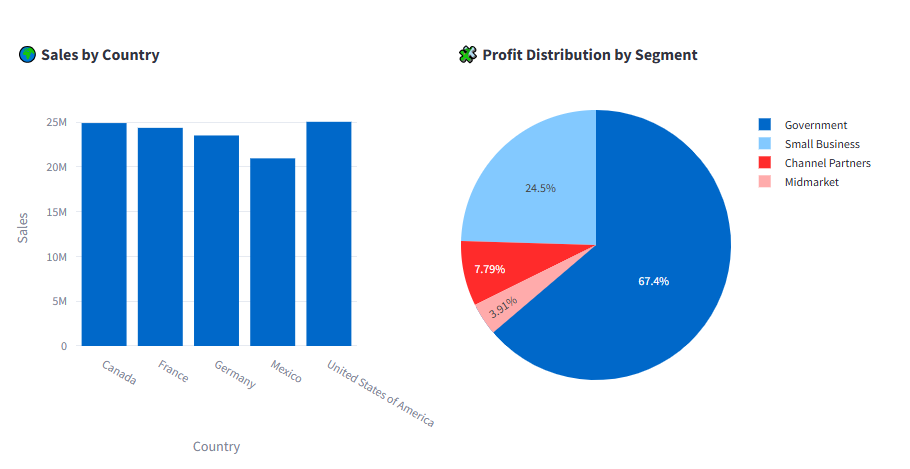
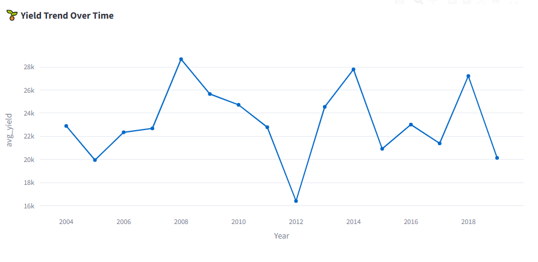
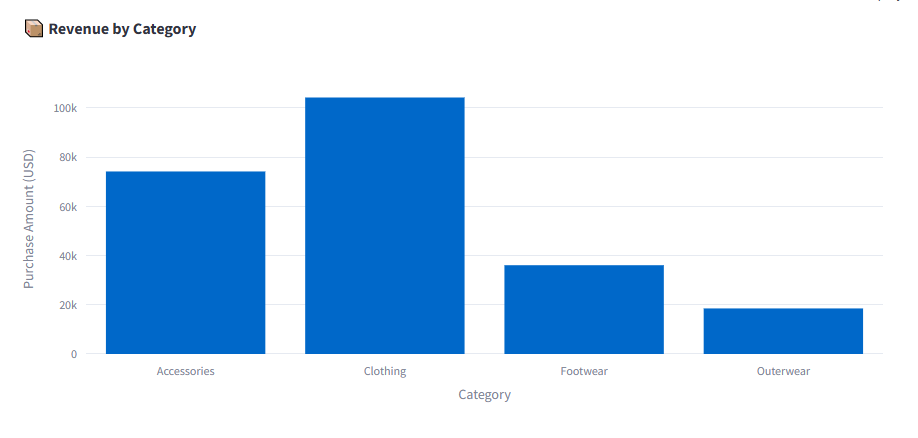

# 📊 Data Analysis Projects | Projets d’Analyse de Données

Interactive multi-page analytics dashboards built with Python for financial analysis, customer behavior insights, and agricultural seasonality exploration.

Plateforme interactive multi-pages développée en Python pour l’analyse financière, le comportement des clients et l’exploration de la saisonnalité agricole.

---

# 🚀 Features | Fonctionnalités

## 📈 Financial Performance Dashboard

* Revenue and profitability analysis
* Sales trends over time
* Country and segment performance
* Product profitability insights

## 📈 Tableau de Bord Financier

* Analyse des revenus et de la rentabilité
* Tendances des ventes dans le temps
* Performance par pays et segment
* Analyse de la rentabilité des produits

---

## 👥 Customer & Seasonality Insights

* Agricultural yield analysis
* Seasonality trends by month and year
* Rainfall impact on yields
* Crop performance comparison

## 👥 Analyse Clients & Saisonnalité

* Analyse des rendements agricoles
* Tendances saisonnières par mois et année
* Impact des précipitations sur les rendements
* Comparaison des performances des cultures

---

## 🛍️ Customer Behavior & Revenue Drivers

* Customer purchase analysis
* Revenue by product category
* Payment method distribution
* Demographic insights

## 🛍️ Comportement Client & Facteurs de Revenus

* Analyse des achats clients
* Revenus par catégorie de produits
* Répartition des méthodes de paiement
* Analyse démographique
# 📊 Dashboard Preview

## 📈 Financial Dashboard



---

## 🌾 Agriculture Dashboard



---

## 🛍️ Customer Dashboard


---

# 🧰 Tech Stack

* Python
* Streamlit
* Pandas
* Plotly Express
* DuckDB
* NumPy

---

# 📂 Project Structure | Structure du Projet

```text
project/
│
├── components/
├── data/
├── pages/
├── screenshots/
├── requirements.txt
└── README.md
```

---

# ▶️ Run Locally | Exécution Locale

## 1. Clone repository

```bash
git clone https://github.com/your-username/Analytics.git
```

## 2. Install dependencies

```bash
pip install -r requirements.txt
```

## 3. Launch application

```bash
streamlit run pages/main.py
```

---

# 📊 Objective | Objectif

Provide interactive and data-driven dashboards to support business and agricultural decision-making.

Fournir des tableaux de bord interactifs et pilotés par les données pour soutenir la prise de décision en entreprise et en agriculture.

---

# 👨‍💻 Author | Auteur

Developed by **Amidou Nahimana**
Data Analytics • Agribusiness • Business Intelligence
